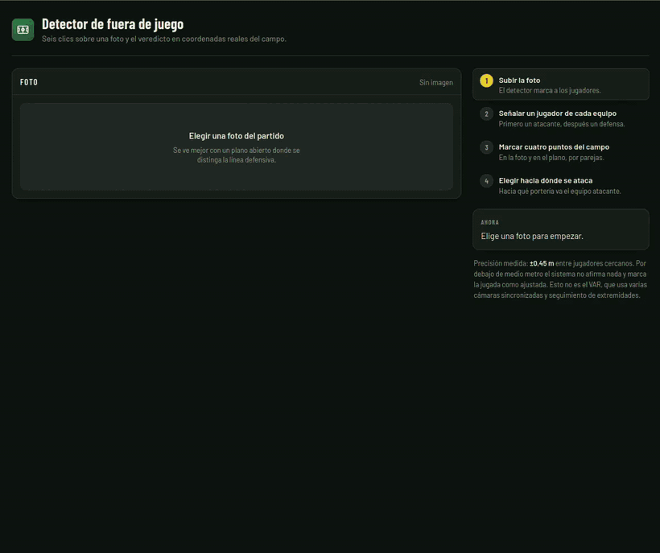

# Detector de fuera de juego

A partir de una foto de un partido, seis clics y una homografía, devuelve el veredicto
en coordenadas reales del campo.



Detecta a los jugadores en posición adelantada combinando un detector afinado con transfer
learning, visión por computador, cálculos homográficos y separación de jugadores por equipos.

## Qué hace

### Detección de jugadores

Mediante ResNet + transfer learning obtenemos los jugadores que se encuentran en el terreno
de juego ubicándolos mediante cajas. Mediante un filtro nos quedamos solo con los que estén
en el campo, eliminando falsos positivos que no intervienen en la jugada.

### Clics en atacante y defensor

Para saber los equipos y poder separar a los jugadores de forma más fiable. Se puede clicar
cualquiera, pues el jugador clicado no tiene por qué ser el analizado para el fuera de juego.

### Clics en el campo

Necesario para calcular la homografía del campo y poder presentar un resultado en vista cenital,
facilitando también el cálculo de la línea de fuera de juego y un veredicto mucho mejor.

### Resultado

Al terminar los pasos anteriores muestra tanto la imagen con la línea dibujada como un plano
cenital de puntos para representar el fuera de juego. Por otro lado, da un veredicto indicando si
hay o no jugadores en fuera de juego y cuáles son las distancias.

## Resultados medidos

Estos son números medidos a lo largo de la realización del proyecto:

  - Recall del detector: 0,950
  - Precisión de la homografía: ±0,45 m entre jugadores cercanos
  - Los fallos de la API pasaron del 76 % al 10 % al estimar el césped de cada imagen

## Limitaciones

El proyecto tiene limitaciones importantes, a continuación las indico:

  - Solamente se cuenta con una foto por jugada: no hay seguimiento entre fotogramas.
  - La homografía solo es válida para los jugadores que pisan el suelo: se transforma el pie, no la cabeza.
  - La precisión se degrada al extrapolar, así que los 4 puntos deben encerrar la zona de la jugada.
  - La detección de jugadores no es perfecta: se escapan jugadores y aparecen falsos positivos.
  - La separación por equipos tampoco acierta siempre. Cuando el recorte de un jugador no tiene
    camiseta legible se marca como "dudoso" en vez de adivinar, y si ese dudoso está por delante
    de la línea puede cambiar el veredicto. El sistema avisa en ese caso.
  - Es semiautomático: necesita los clics de atacante y defensa y los 4 puntos del campo.
  - **Esto no es el VAR**, que usa varias cámaras sincronizadas y seguimiento de extremidades.

## Cómo funciona

```
foto  ->  Faster R-CNN (ResNet50)  ->  cajas de jugadores
      ->  2 clics atacante/defensa ->  reparto por equipos
      ->  4 clics foto + plano     ->  homografía 3x3, pies a metros
      ->  dirección de ataque      ->  último defensa, línea y veredicto
```

Toda la lógica vive en Python. El navegador no decide nada: manda cinco datos a la API
y dibuja la respuesta, así que se podría sustituir por otro cliente sin tocar el cálculo.

## Decisiones técnicas

Decisiones tomadas para resolver los problemas que fueron apareciendo:

- **Semillas en vez de agrupamiento.** El reparto no supervisado era malo, así que son dos
  clics del usuario los que fijan cada equipo. Además resuelven de paso qué equipo defiende.

- **Recorte del torso**, no de la caja entera: la cabeza y las piernas meten césped y piel
  en el descriptor de la camiseta, por lo que tenerlo bien ajustado nos daba un resultado
  mejor.

- **Marcar "dudoso" en vez de adivinar.** Cuando el recorte no tiene camiseta legible, el
  sistema lo indica. Y solo avisa si ese dudoso está por delante de la línea, que es el único
  caso en el que podría cambiar el veredicto.

- **Dirección de ataque explícita.** Es lo que fija el signo de todo el cálculo: con ella se
  sabe qué defensa pone la línea y hacia qué lado se miden las distancias.

## Instalación

Probado con **Python 3.10** en Linux.

```bash
git clone https://github.com/juuanmartiinez/offside-detector.git
cd offside-detector

python3 -m venv .venv
source .venv/bin/activate

pip install -r requirements.txt
```

Arrancar el servidor **desde la raíz del proyecto**, que es donde busca la carpeta `web/`:

```bash
uvicorn api.main:app --reload
```

Y abrir <http://127.0.0.1:8000>.

### Los pesos del modelo

El checkpoint entrenado pesa 159 MB, por encima del límite de 100 MB por fichero de GitHub,
así que va publicado aparte como asset de la release. La API lo busca en `outputs/` al arrancar:

```bash
mkdir -p outputs
wget -P outputs/ https://github.com/juuanmartiinez/offside-detector/releases/download/v1.0/modelo_experimento_ResNet_20ep.pt
```

Si prefieres entrenarlo tú, el proceso está en `notebooks/1.2-train.ipynb`.

## Estructura del proyecto

```
offside-detector/
├── api/
│   ├── main.py             FastAPI: los dos endpoints y el servido de la web
│   └── esquema.py          modelo Pydantic de la petición de análisis
├── src/
│   ├── modelo.py           Faster R-CNN ResNet50 con la cabeza sustituida
│   ├── pipeline.py         encadena detección, equipos, homografía y veredicto
│   ├── equipos.py          descriptor de camiseta y reparto por semillas
│   ├── geometria.py        homografía 3x3, punto de apoyo y paso a metros
│   ├── campo.py            máscara de césped y filtro de lo que cae en el campo
│   ├── fueradeJuego.py     la regla: último defensa, línea y veredicto
│   ├── lineas.py           detección de líneas del campo (Hough, exploratorio)
│   ├── calibracion.py      marcado manual de puntos y jugadores
│   ├── viz.py              dibujo sobre la imagen y plano cenital
│   ├── metricas.py         IoU, emparejado y recall del detector
│   ├── CocoDataset.py      lectura del dataset en formato COCO
│   └── DetectionDataset.py adaptador a Dataset de PyTorch
├── web/
│   ├── index.html          la interfaz
│   ├── estilo.css
│   └── app.js              recoge clics, llama a la API y dibuja
├── notebooks/              el desarrollo, de 1.0 a 2.0, en orden cronológico
├── docs/demo.gif
└── requirements.txt
```

## Dataset y créditos

Entrenado sobre [football-players-detection](https://universe.roboflow.com/roboflow-jvuqo/football-players-detection-3zvbc)
(v20), de Roboflow Universe: 372 imágenes anotadas en formato COCO, redimensionadas a
576x576, con las clases `player`, `goalkeeper`, `referee` y `ball`.

Licencia del dataset: **CC BY 4.0**.

El detector parte de `fasterrcnn_resnet50_fpn` de torchvision, preentrenado en COCO, con la
cabeza de clasificación sustituida y afinado sobre ese conjunto.